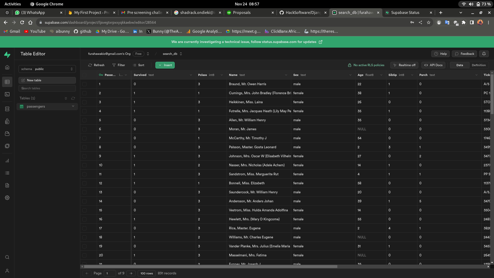
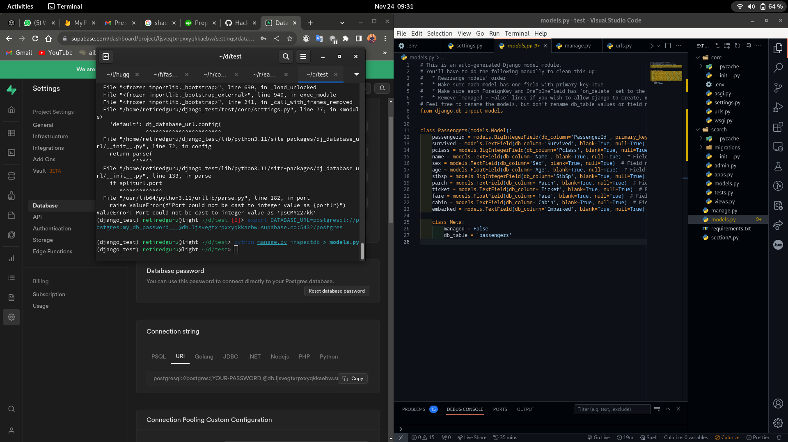
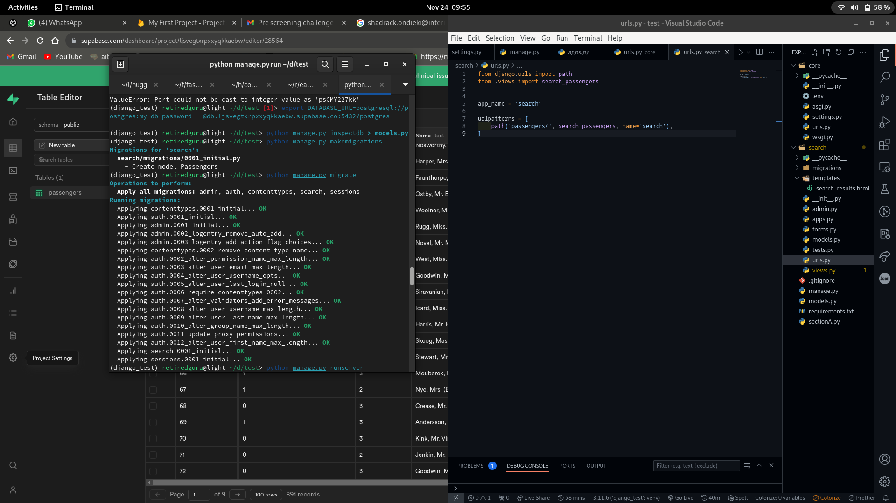
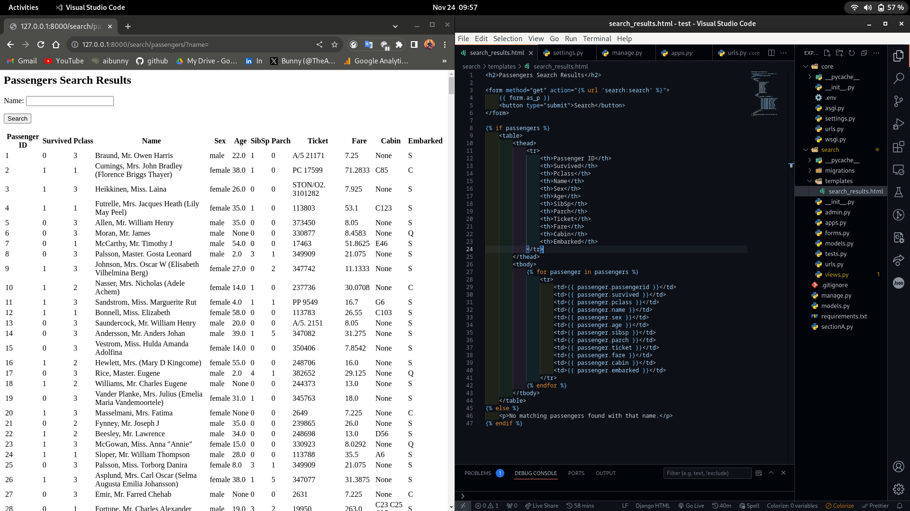
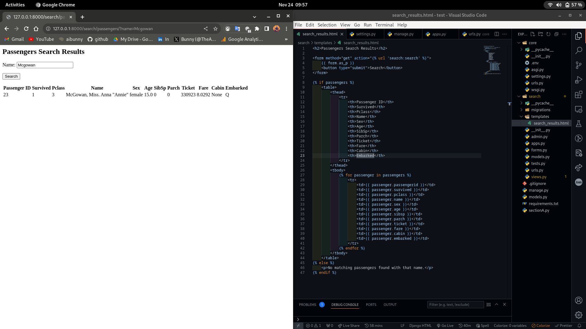
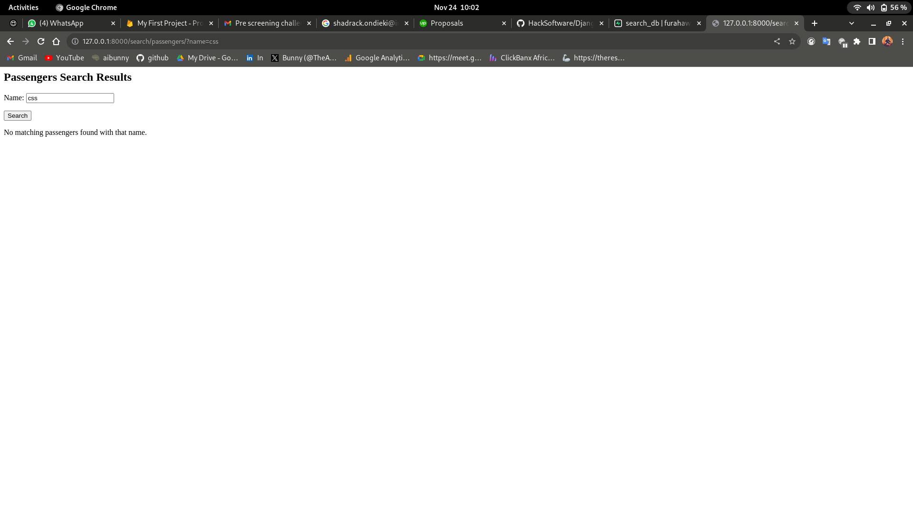
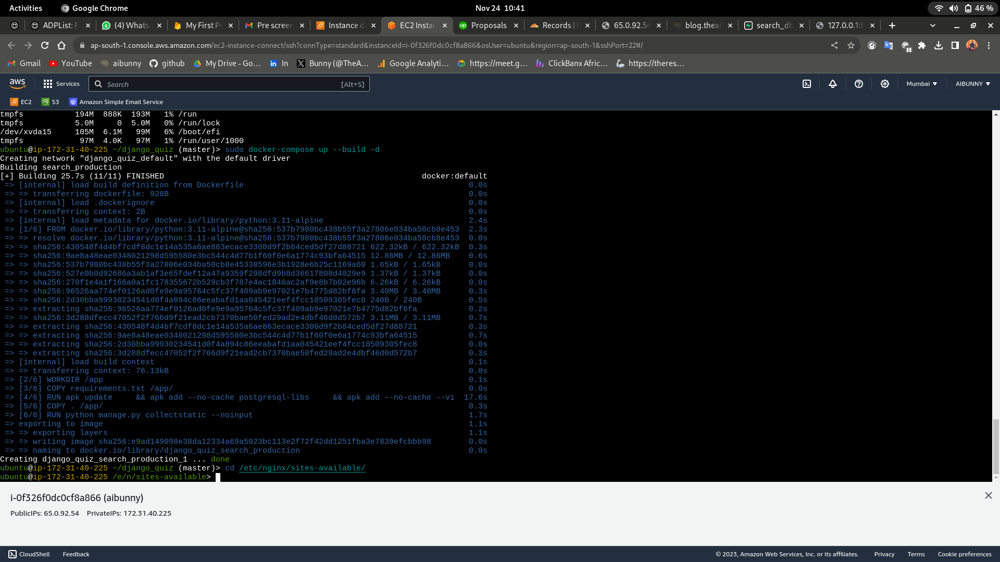
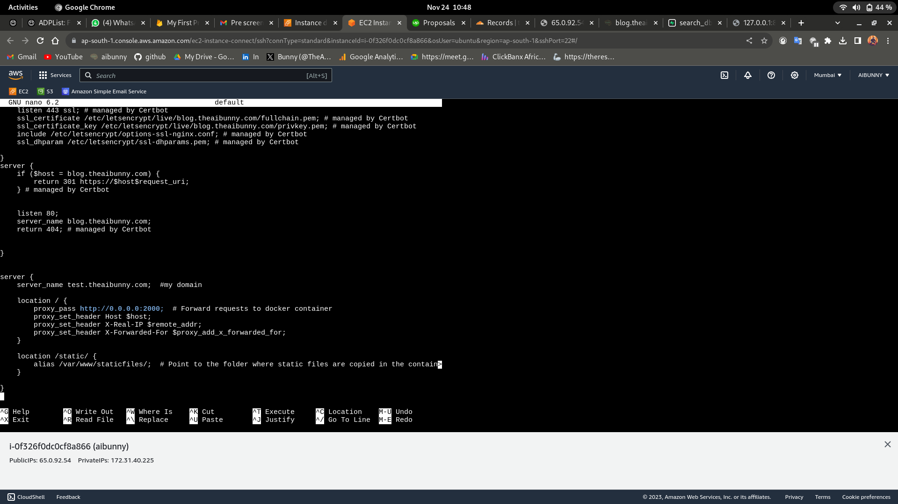
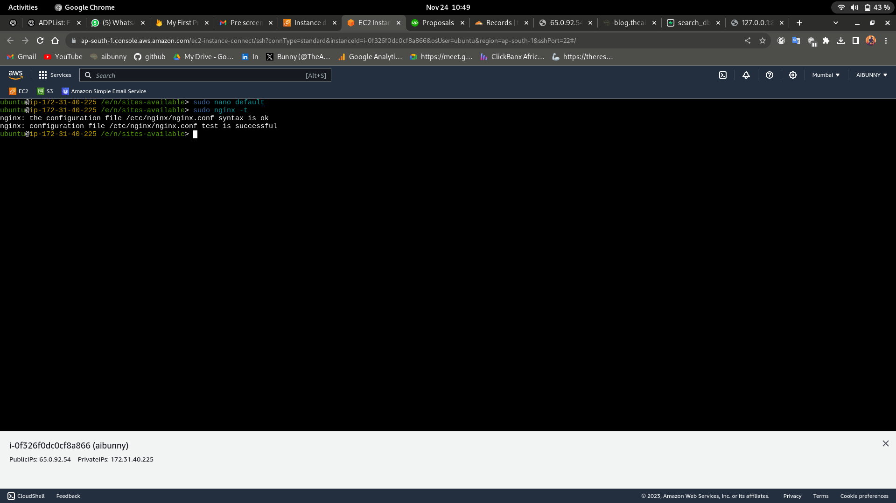
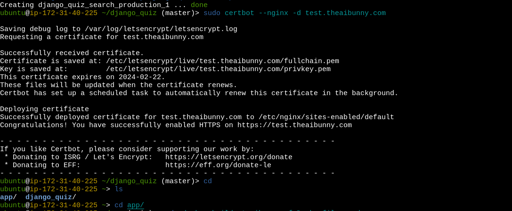

# Implementation Engineer Interview Questions Response to section B question 2

section A answers =>[answers](https://github.com/aibunny/django_quiz/blob/master/sectionA.md)

This repository contains the solutions to the Implementation Engineer interview questions. Below, you'll find detailed explanations, commands, screenshots, and configurations for each step I took.

This is the live link to test the project [LIVE](https://test.theaibunny.com/search/passengers)

## Table of Contents

1. [Django Project Setup](##1)
2. [Configuring PostgreSQL](##2)
3. [Creating a Django Model](##3)
4. [Form Views, Templates and URLS](##4)
5. [Testing](##5)
6. [Dockerizing the application](##6)
7. [Deploying/Serving the app](##7)
8. [Running Locally](##8)

## 1. Django Project Setup

This section explains how I set up the virtual environment, installed Django, and create a Django project and created an app called `search` that will have my search and results logic.

```bash
python3 -m venv venv
source venv/bin/activate
#install django, pycopg2-binary and python-dotenv for enviroment variables
pip install django psycopg2-binary python-dotenv
django-admin startproject core
cd core
python manage.py startapp search
```

In the project settings at `core.settings` I updated the `SECRET_KEY ` and `DEBUG` settings to be set using enviroment vaiables which I added in my .env file and using `dotenv` I will  import them to my settings

```python
#setting.py

import os
from pathlib import Path
from dotenv import load_dotenv

load_dotenv()


SECRET_KEY = os.getenv("SECRET_KEY")

# set debug to False by default
DEBUG = os.getenv("DEBUG", False)

#.... other settings
```

I registered the new `search` app in the `INSTALLED_APPS`

```python
#setting.py
INSTALLED_APPS = [
    'django.contrib.admin',
    'django.contrib.auth',
    'django.contrib.contenttypes',
    'django.contrib.sessions',
    'django.contrib.messages',
    'django.contrib.staticfiles',
]

PROJECT_APPS = [
    'search'
]

INSTALLED_APPS += PROJECT_APPS

```

also registered the urls for the `search` app in the `core.urls` since I was going to create them:

```python
from django.contrib import admin
from django.urls import path, include

urlpatterns = [
    path('admin/', admin.site.urls),
    path('search/', include('search.urls')),
]

```

## 2. Configuring PostgreSQL

For this section I decided to use [supabase](https://supabase.com/) to host my db since I wanted to host the application on an AWS EC2 instance for testing and also to show my expertise. I used `dj-database-url` to connect the django project to the Postgres db provided by supabase using the `DATABASE_URL`

```python
import dj_database_url

DATABASES = {
    'default': dj_database_url.config(
        default=os.getenv("DATABASE_URL"), conn_max_age=600),
}
```

since I wanted this to be practical I uploaded a csv file to the database containing the titanic dataset which is publicly available [titanic csv](titanic.csv) and  named the table as `passengers` then set the `PassengerId `as the `primary_key`

## 3. Creating Django Models

Since my db already had data  making it a legacy db and I wanted to use the `passengers` table I inspected the database using `python manage.py inspectdb > models.py` to create a `models.py` file in the root  directory which I later copied it's content to the `models.py` file in the `search` app



here is the `models.py`

```python
from django.db import models


class Passengers(models.Model):
    passengerid = models.BigIntegerField(db_column='PassengerId', primary_key=True)  # Field name made lowercase.
    survived = models.TextField(db_column='Survived', blank=True, null=True)  # Field name made lowercase.
    pclass = models.BigIntegerField(db_column='Pclass', blank=True, null=True)  # Field name made lowercase.
    name = models.TextField(db_column='Name', blank=True, null=True)  # Field name made lowercase.
    sex = models.TextField(db_column='Sex', blank=True, null=True)  # Field name made lowercase.
    age = models.FloatField(db_column='Age', blank=True, null=True)  # Field name made lowercase.
    sibsp = models.BigIntegerField(db_column='SibSp', blank=True, null=True)  # Field name made lowercase.
    parch = models.TextField(db_column='Parch', blank=True, null=True)  # Field name made lowercase.
    ticket = models.TextField(db_column='Ticket', blank=True, null=True)  # Field name made lowercase.
    fare = models.FloatField(db_column='Fare', blank=True, null=True)  # Field name made lowercase.
    cabin = models.TextField(db_column='Cabin', blank=True, null=True)  # Field name made lowercase.
    embarked = models.TextField(db_column='Embarked', blank=True, null=True)  # Field name made lowercase.

    class Meta:
        #set to false since the table already exsisted
        managed = False
        db_table = 'passengers'
```

after creating my model I run my migrations and applied them using:

```python
python manage.py makemigrations
python manage.py migrate
```



## 4. Forms, Views, Templates and URLS

In this part I created the `forms.py` in the `search` app then defined a `name` as the field I wanted to search the passengers with:

```python
#forms.py
from django import forms

class PassengerSearchForm(forms.Form):
    name = forms.CharField(required=False, label= "Name")
```

In the views I created the a function-based called `search_passengers`  view that returned passengers given depending on whether the name passed in the form  is contained in any of the passenger names.

```python
#views.py
from django.shortcuts import render
from . models import *
from . forms import *

def search_passengers(request):
    form = PassengerSearchForm(request.GET)
    passengers =Passengers.objects.all()
  
    if form.is_valid():
        #Apply filter based on name in the form data
        name = form.cleaned_data.get('name')
  
        if name:
            passengers = passengers.filter(name__icontains=name)
  
        return render(request, 'search_results.html', {'form': form, 'passengers': passengers})
```

For the templates I created a  `template` folder in the `search` app and added a `search_results.html` file that would contain a table to show the results and the form to search for the results that I had created earlier

```html
<h2>Passengers Search Results</h2>

<form method="get" action="">
    {{ form.as_p }}
    <button type="submit">Search</button>
</form>


    <table>
        <thead>
            <tr>
                <th>Passenger ID</th>
                <th>Survived</th>
                <th>Pclass</th>
                <th>Name</th>
                <th>Sex</th>
                <th>Age</th>
                <th>SibSp</th>
                <th>Parch</th>
                <th>Ticket</th>
                <th>Fare</th>
                <th>Cabin</th>
                <th>Embarked</th>
            </tr>
        </thead>
        <tbody>
            
                <tr>
                    <td>{{ passenger.passengerid }}</td>
                    <td>{{ passenger.survived }}</td>
                    <td>{{ passenger.pclass }}</td>
                    <td>{{ passenger.name }}</td>
                    <td>{{ passenger.sex }}</td>
                    <td>{{ passenger.age }}</td>
                    <td>{{ passenger.sibsp }}</td>
                    <td>{{ passenger.parch }}</td>
                    <td>{{ passenger.ticket }}</td>
                    <td>{{ passenger.fare }}</td>
                    <td>{{ passenger.cabin }}</td>
                    <td>{{ passenger.embarked }}</td>
                </tr>
            
        </tbody>
    </table>

    <p>No matching passengers found with that name.</p>

```

I created a `urls.py` file in the search app to contain the routes for my search app and registered the `search_results` view there:

```python
from django.urls import path
from .views import search_passengers


app_name = 'search'

urlpatterns = [
    path('passengers/', search_passengers, name='search'),
]
```


## 5. Testing

I run `python manage.py runserver` on terminal so i could test and accesses the url `http://localhost:8000/search/passengers` to access the search and results page.








## 6. Dockerizing the app

I created a Dockerfile to build an Image for the app using an alpine image then used docker compose to build and run the application.

The Dockerfile:

```python
#Dockerfile

# Use an official Alpine Linux image as the base image
FROM python:3.11-alpine

# Set environment variables
ENV PYTHONDONTWRITEBYTECODE 1
ENV PYTHONUNBUFFERED 1

# Set the working directory
WORKDIR /app

# Copy the requirements file to the working directory
COPY requirements.txt /app/

# Install dependencies for the image and the project
RUN apk update \
    && apk add --no-cache postgresql-libs \
    && apk add --no-cache --virtual .build-deps \
        gcc \
        musl-dev \
        postgresql-dev \
    && pip install --no-cache-dir -r requirements.txt \
    && apk --purge del .build-deps

# Copy the project files to the working directory
COPY . /app/

# collect static files
RUN python manage.py collectstatic --noinput

# Expose the port the search app runs on
EXPOSE 8000

# Run the application using wsgi
CMD ["gunicorn", "--bind", "0.0.0.0:8000", "core.wsgi:application"]

```

The docker-compose file;

```yaml
version: '3'

services:
  search_production:
    build:
      context: .
    ports:
      - "2000:8000"
  

```

I mapped my host port `2000` to the container port `8000` since my other ports were running my other projects.

I pushed this code to git then cloned it to my EC2 instance where I built and created the nginx files.

Then I run `docker-compose up --build -d`




## 7. Deploying/Serving Using Nginx

I created a simple server block to map the domain I intended to host and redirect all requests to the port `2000` I exposed above and configures the static file directory:

```yaml
server {
    server_name test.theaibunny.com;  #my domain

    location / {
        proxy_pass http://0.0.0.0:2000;  # Forward requests to docker container
        proxy_set_header Host $host;
        proxy_set_header X-Real-IP $remote_addr;
        proxy_set_header X-Forwarded-For $proxy_add_x_forwarded_for;
    }

    location /static/ {
        alias /var/www/staticfiles/;  # Point to the folder where static files are copied in the container
    }

}

```




testing nginx



Finally I generated an ssl certificate for the domain `test.theaibunny.com` using certbot:



This is the live link to test the project [LIVE](https://test.theaibunny.com/search/passengers)

## 8. Run Locally


1. Clone the Repository:

   ```bash
   git clone git@github.com:aibunny/django_quiz.git

   cd django_quiz
   ```
2. Environment Variables:

   Create a `.env` file in the project root and add the following:

   ```

   SECRET_KEY=your_secret_key
   DATABASE_URL=your_database_url

   ```

    Replace`your_secret_key` and `your_database_url` with the appropriate values.

3. Build and Run the Docker Containers:
   ```bash
   `docker-compose up --build -d`
   ```
